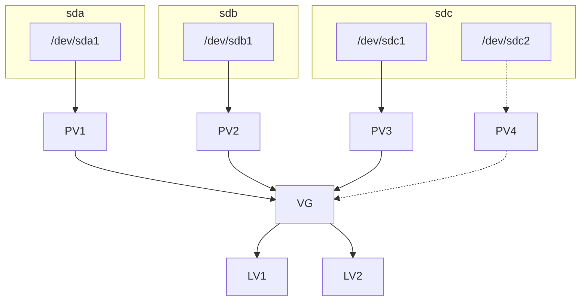

# lvm



创建pv

pvcreate /dev/sdc2

查看pv

pvscan

查看vg

vgscan

vgdisplay

创建vg

vgcreate centos /dev/sdc1

vg扩容

vgextend centos /dev/sdc2

查看 lv

lvscan

调整lv大小

lvextend -L +30G -f -r /dev/centos/home

lvextend -l +100%FREE /dev/centos/home

resize2fs /dev/centos/home

例子
```bash
# 使用fdisk/gdisk命令添加分区
gdisk /dev/vdb

# 创建pv
pvcreate /dev/vdb2
# vg扩容
vgextend centos /dev/vdb2
# 调整lv大小
lvextend -l +100%FREE /dev/centos/home
resize2fs /dev/centos/home
```
