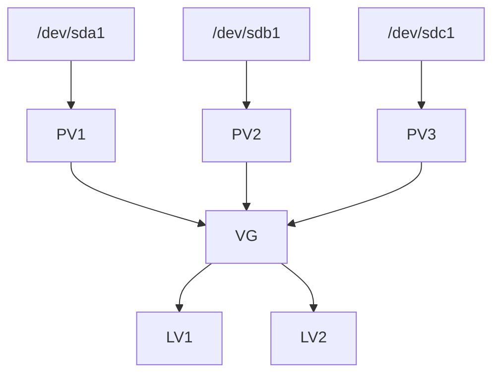

# lvm

```mermaid
graph TD
/dev/sda1-->PV1
/dev/sdb1-->PV2
/dev/sdc1-->PV3
PV1-->VG
PV2-->VG
PV3-->VG
VG-->LV1
VG-->LV2
```

查看pv

pvscan

查看vg

vgscan,vgdisplay

查看 lv

lvscan

调整lv大小

lvextend -L +30G -f -r /dev/centos/home1

