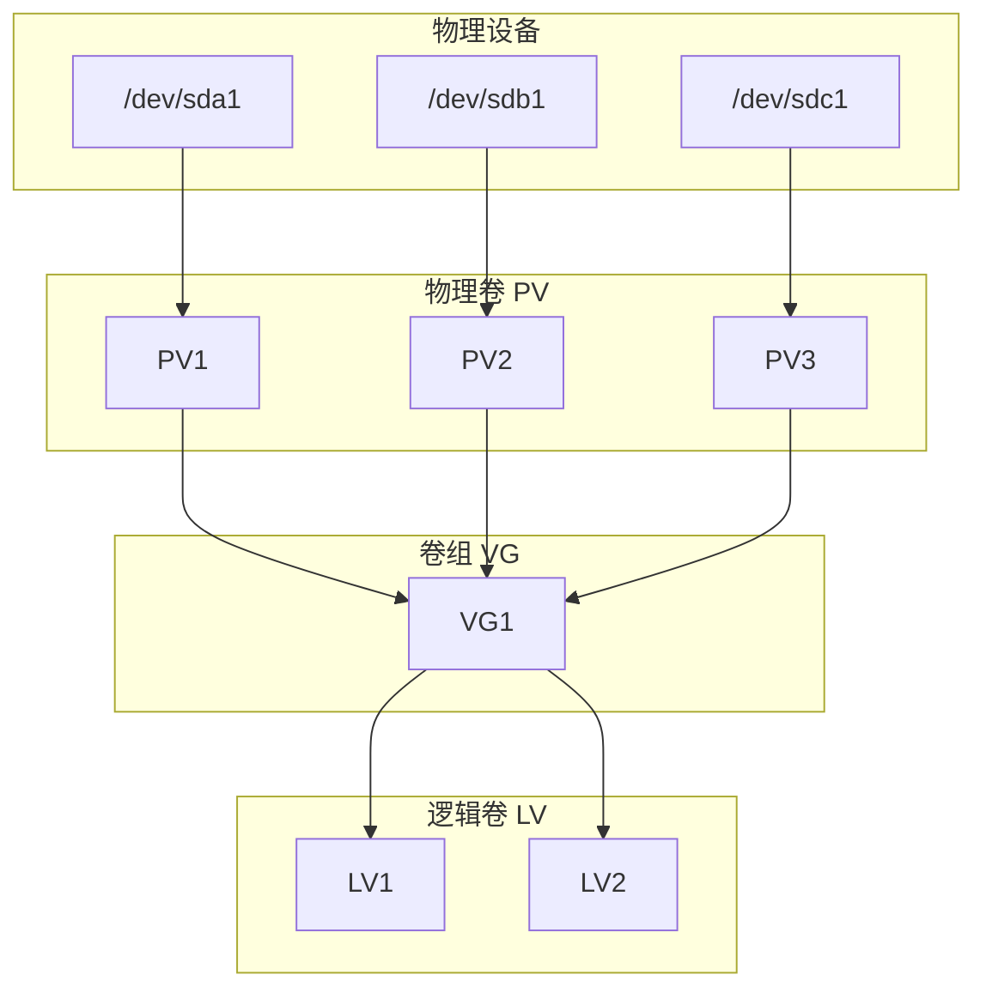

# LVM (Logical Volume Management)

## LVM 架构


## 基本操作
### 物理卷 (PV)
```bash
# 创建 PV
pvcreate /dev/sdc2

# 查看 PV
pvscan
pvdisplay
```

### 卷组 (VG)
```bash
# 创建 VG
vgcreate centos /dev/sdc1

# 扩展 VG
vgextend centos /dev/sdc2

# 查看 VG
vgscan
vgdisplay
```

### 逻辑卷 (LV)
```bash
# 查看 LV
lvscan
lvdisplay

# LV 扩容
lvextend -L +30G -f -r /dev/centos/home    # 增加 30G
lvextend -l +100%FREE /dev/centos/home     # 使用所有剩余空间
resize2fs /dev/centos/home                 # 调整文件系统大小

# LV 缩容
umount /home                               # 先卸载
resize2fs /dev/centos/home 20G            # 缩小文件系统
lvreduce -L 20G /dev/centos/home          # 缩小逻辑卷
mount /home                                # 重新挂载
```

## 扩容示例
```bash
# 1. 添加新分区
gdisk /dev/vdb

# 2. 创建 PV
pvcreate /dev/vdb2

# 3. 扩展 VG
vgextend centos /dev/vdb2

# 4. 扩展 LV
lvextend -l +100%FREE /dev/centos/home
resize2fs /dev/centos/home
```

## 缩容示例
```bash
umount /home
resize2fs /dev/centos/home {分区大小}
lvreduce -L {分区大小} /dev/centos/home
: or
lvreduce -l -100G /dev/centos/home
resize2fs /dev/centos/home {分区大小}
```

## 参考文档
- LVM HOWTO：<https://tldp.org/HOWTO/LVM-HOWTO/>
- Red Hat LVM 管理：<https://access.redhat.com/documentation/en-us/red_hat_enterprise_linux/8/html/configuring_and_managing_logical_volumes/index>
